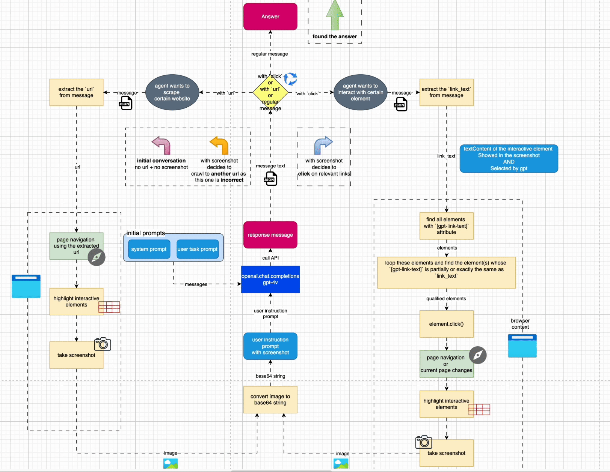

# Web AI Agent

This project is a web AI agent built with TypeScript and Node.js. It uses Puppeteer for browser automation and OpenAI for natural language processing.

## Overview

The graph below shows the detailed architecture of the agent.



## Structure

```
agent.ts
services/
├── browser-controller.ts
├── data-transformer.ts
├── element-annotator.ts
├── openai.ts
├── prompt-map.ts
└── user-prompt-interface.ts
utils.ts
```

## Steps to run

1. Clone the repository
2. Run `yarn` to install the dependencies
3. Create a `.env` file in the root directory and add the following environment variables: Google_Chrome_Path, Google_Chrome_User_Data_Dir, PROFILE, OpenAI_API_Key

- If you are using Chrome as the scraping browser, it cannot be used for other purposes, so it is recommended to use Chrome Canary for scraping. You can download it [here](https://www.google.com/chrome/canary/).
- The env variables have been typed in the `global.d.ts` file. You can modify the names per your preference.
- Most of the env variables are used for `puppeteer launchOptions`, Please refer to [docs](https://pptr.dev/api/puppeteer.launchoptions) for more information.

`global.d.ts:`

```typescript
namespace NodeJS {
  interface ProcessEnv {
    // Option 1: Use Chrome
    GOOGLE_CHROME_PATH: string;
    GOOGLE_CHROME_USER_DATA_DIR: string;
    // Option 2: Use Chrome Canary
    GOOGLE_CHROME_CANARY_PATH: string;
    GOOGLE_CHROME_CANARY_USER_DATA_DIR: string;
    PROFILE: string; // The profile name of the user, e.g. "Profile 1" or "Default"
    OPENAI_API_KEY: string;
  }
}
```

4. Run `yarn dev agent/agent.ts` to start the agent
5. Input your query and the agent will open a new browser window and start the workflow.

## Additional Information

For the detailed documentation, please refer to the [medium article](https://medium.com/@bianbianzhu123/revolutionize-web-browsing-with-ai-5d5f6ce5f5df).

## WARNING

This project is a proof of concept and is not production-ready, and more features will be added in the future.

It is recommended to use it for educational purposes only. The cost of openAI GPT-4 vision preview is:

```
Input tokens: $10.00 per 1 million tokens
Output tokens: $30.00 per 1 million tokens
```

It would easily burn you $1+ per run.
