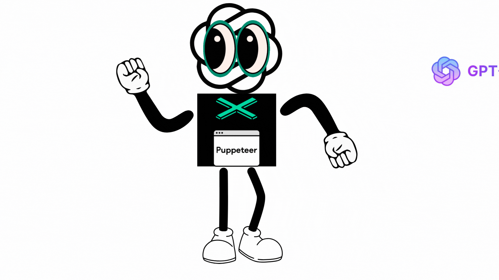
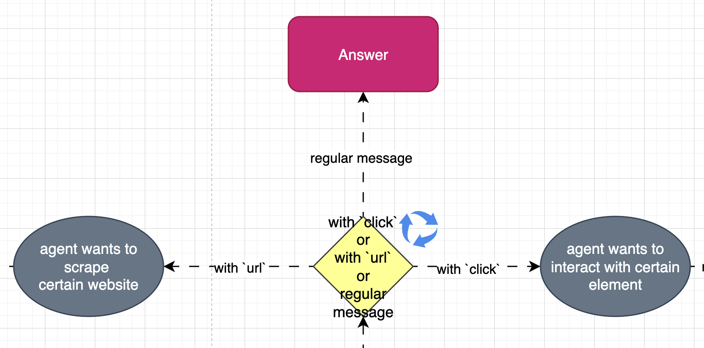
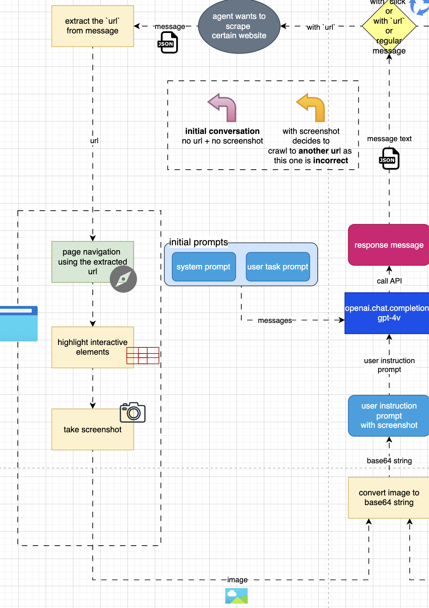
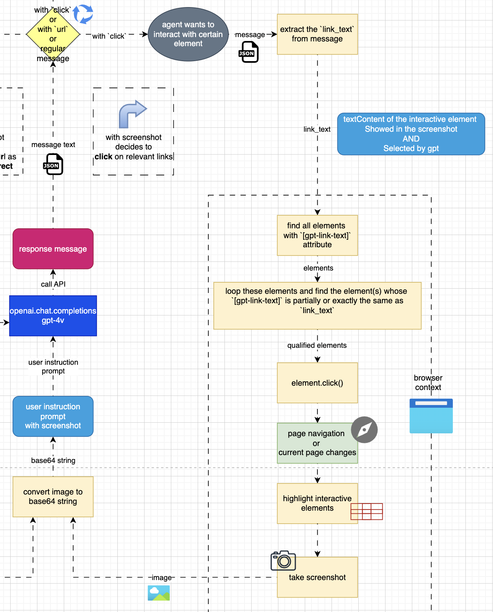
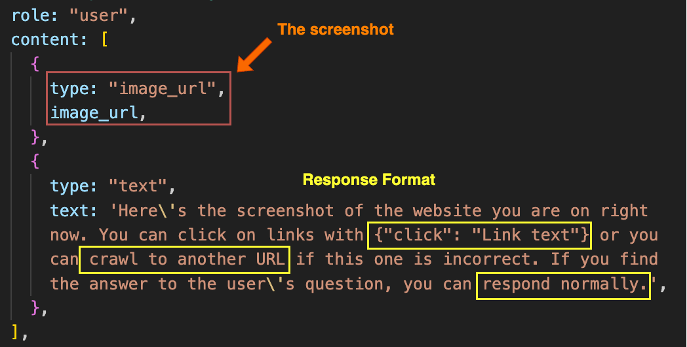
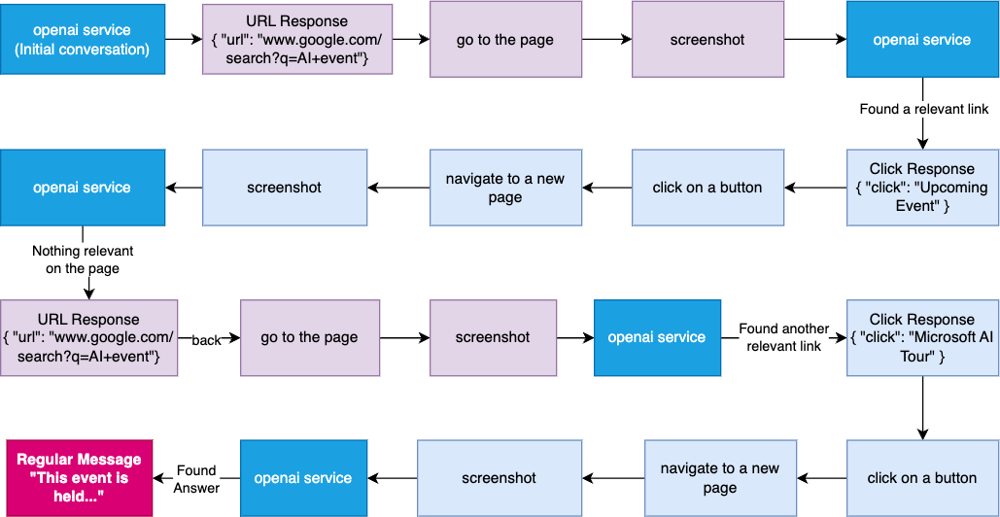

# Web AI Agent

## Introduction

In this article, we'll explore and build an AI agent that utilizes the power of new `gpt-4-vision-preview` model from OpenAI. The model can analyze images and provide textual responses

This agent will be able to interact with the user, control a web browser, and process data. We'll explore its structure and how it works.

## Overview

Imagine you're keen on attending an AI event in your city this month, but you have specific criteria in mind, perhaps related to timing or the focus of the event. Normally, this would involve the following process:

- Launching a web search with terms like "AI events in [your city] this month."
- Sifting through search results to find a link that seems promising.
- Navigating the chosen website to determine its relevance, possibly needing to delve deeper through additional links.
- After much back and forth, finally pinpointing the event that fits your criteria and noting its details for your calendar.

If we break down the above process, it basically involves steps that can be categorized into the following:

1. Control the browser, such as go to a URL, click on a link, go back, etc.
1. Browser through the content of a page
1. Make decisions based on the content of that page, such as whether to click on a link or not.

Enter the AI agent, it does exactly what you do as we described above.

1. Browser Control: the AI uses tools like `Puppeteer` to navigate the internet. Think of Puppeteer as the AI's hands, allowing it to open tabs, click on links, and navigate web pages with ease.

1. Content Browsing: Think of this as the AI's eyes. `Puppeteer` can take screenshots of web pages, and feed them to the AI.

1. Decision-Making: This is where the AI's brain, powered by Large Language Models (LLM), comes into play. It assesses the screenshot of each page, analyzing the image, determining relevance and deciding on the next steps, mimicking human judgment.



## Architecture

As we are now clear on how the AI agent works, let's take a look at the architecture of the agent. The agent is structured as follows:


This architecture may look complex at first, but it's actually quite simple once you understand the different components and how they work together. Let's break it down.

### Starting Out

This is the starting point of the workflow. The user interacts with the agent by providing a prompt which clarifies the task (`user task prompt`). At the same time, the agent gets some default instructions (`system prompt`), about how it should do its job. These instructions tell the agent what its role is, how to format its answers, and other important info.

Here's a simple view of the starting point:


The example of the `user task prompt` might be:

```
I'm looking for AI events in Melbourne this month. Please prioritize events that are on weekends.
```

And here's what the system prompt might look like:

<image src="system-prompt.png" width=800>

Credit: [JayZeeDesign](https://github.com/JayZeeDesign/Scrape-anything---Web-AI-agent)

The system prompt is crucial because they help the agent decide how to act. The three main areas are highlighted in different colors:

- <p><span style="color:Aqua; font-weight: bold">The Agent's Role: </span> What the agent is supposed to do.</p>
- <p><span style="color:red; font-weight: bold">Response Format: </span>How the agent should present its answers.</p>
- <p><span style="color:yellow; font-weight: bold">Additional info: </span>Extra instructions to help the agent.</p>

The prompts are then sent to the openai service, which is responsible for generating responses.

Based on these prompts, the agent's response will be shaped into only 3 types:

1. `{ "url": "https://www.example.com" }` - The agent wants to navigate to a specific webpage.
2. `{ "click": "text on a button" }` - The agent wants to click on a specific element on the page.
3. `regular message` - The agent has finished the task and extracted the required information to the user.

For the initial conversation, the response would normally be a Google search url, such as `https://www.google.com/search?q=AI+events+in+Melbourne+March`. This response would then trigger the browser-controller service to navigate to the URL.

### Code implementation of the starting point

```typescript
const messages: ChatCompletionMessageParam[] = [];

// STEP 1: Welcome the user
console.log(staticMessageMap.welcome);

// STEP 2: provide the context of the conversation - system prompt
messages.push(promptMap.context());

// STEP 3: Ask and apply the user's query as a task - user task prompt
const userPrompt = await userPromptInterfaceV2(staticMessageMap.you);
messages.push(promptMap.task(userPrompt));
```

An important note is that to allow the LLM to have the `memory` of the conversation, we need to always push the new prompts to the message array and send the whole array to the LLM. This could cause the explosion of the tokens. Use the `max_tokens` parameter to build the safe net.

Below is how to use the openai service to generate the response.

```typescript
const taskFlow = async (): Promise<void> => {
  console.log(`${staticMessageMap.agent}Let me think...`);
  // Start the conversation with the LLM
  const response = await openai.chat.completions.create({
    model: "gpt-4-vision-preview",
    max_tokens: 1024,
    messages, // The messages array which contains the conversation history is sent to the LLM
    temperature: 0,
  });

  // For the initial conversation, the agent will respond with the url (google search if not provided by the user)
  const { message } = response.choices[0];
  const { content: messageText } = message;
  if (messageText === null) {
    throw new Error("The response message text is null");
  }
  // Show the response in the terminal
  console.log(`${staticMessageMap.agent}${messageText}`);

  // Memorize the answer from agent
  messages.push({
    role: "assistant",
    content: messageText,
  });
};

await taskFlow();
```

And of course, to use `openai` service, you need to have the `openai` package installed and the API key. Here is a seperate file to handle the openai service.

```typescript
import dotenv from "dotenv";
dotenv.config();
import OpenAI from "openai";

/**
 * An instance of the OpenAI Class that can invoke the API methods
 * @example `openai.chat.completions.create`
 */
export const openai = new OpenAI({
  apiKey: process.env.OPENAI_API_KEY,
});
```

## Pick the Right Path

As we mentioned earlier, the LLM response will be shaped into only 3 types. Each of these types will trigger a different browser-controller service to act accordingly.



### URL Response Flow - Response format `{ "url": "https://www.example.com" }`

- Indicate that the agent should navigate to a specific webpage.
- This response would trigger the following steps in the script:

  1. Extract the URL from the response
  1. Opens a headless browser using Puppeteer and navigates to the URL
  1. The agent then takes a screenshot of the page and sends it with another special instruction prompt back to the LLM to analyze the content of the page and decide on the next steps.



## Click Response Flow - Response format `{ "click": "text on a button" }`

- Indicate that the agent should click on a specific element on the page.
- The agent will undergo the following steps:

  1. Extract the link text from the response
  1. The agent then uses Puppeteer to find the element with the matching text and clicks on it
  1. The agent then takes a screenshot of the page and sends it with another special instruction prompt back to the LLM to analyze the content of the page and decide on the next steps.



Let's take a look at the `special instruction prompt` that the agent sends to the LLM after taking a screenshot of the page.



Credit: [JayZeeDesign](https://github.com/JayZeeDesign/Scrape-anything---Web-AI-agent)

This prompt basically tells the LLM to analyze the screenshot of the page and decide on the next steps. The response format should be exactly as we mentioned in the system prompt. With LLMs, it's often necessary to reiterate rules or guidelines to ensure consistent performance.

## Regular Message Flow - Regular message

- Indicate that the agent has finished the task and extracted the required information to the user.
- This is normally the end of the current task.
- The agent will simply display the information to the user.

### Code implementation of the path selection

```typescript
// Use typescript to define the 3 types of response
export type ResponseMessage =
  | {
      type: ResponseMessageCategory.URL;
      url: string;
    }
  | {
      type: ResponseMessageCategory.CLICK;
      linkText: string;
    }
  // This initial type is simply a placeholder to indicate the start of the conversation in which the LLM has not yet provided a response
  | {
      type: ResponseMessageCategory.INITIAL;
      text: "initial";
    }
  | {
      type: ResponseMessageCategory.REGULAR;
      text: string;
    };
```

A function that converts the plain string response from the LLM to the defined type.

```typescript
export const convertTextToResponseMessage = (text: string): ResponseMessage => {
  // The `extractActionFromString` function is a helper function that simply checks if a string contains a particular pattern, such as '{"url": "' or '{"click": "' which is directly related to the response format. See the repo for the full implementation.
  if (extractActionFromString(text, ResponseMessageCategory.URL) !== null) {
    return {
      type: ResponseMessageCategory.URL,
      url: extractActionFromString(text, ResponseMessageCategory.URL) as string,
    };
  }

  if (extractActionFromString(text, ResponseMessageCategory.CLICK) !== null) {
    return {
      type: ResponseMessageCategory.CLICK,
      linkText: extractActionFromString(
        text,
        ResponseMessageCategory.CLICK
      ) as string,
    };
  }

  if (text === ResponseMessageCategory.INITIAL) {
    return {
      type: ResponseMessageCategory.INITIAL,
      text,
    };
  }

  return {
    type: ResponseMessageCategory.REGULAR,
    text,
  };
};
```

To implement the `Path Selection`, the code should have the following backbone:

```typescript
// messageText is the plain string response from the LLM (see above code)
// It is then converted to the defined type
responseMessage = convertTextToResponseMessage(messageText);

// URL Response Flow
if (responseMessage.type === ResponseMessageCategory.URL) {
  // 1. Extract the URL from the response
  const { url } = responseMessage;
  // 2. Opens a headless browser using Puppeteer and navigates to the URL and take a screenshot of the page
  const imagePath = await screenshot(url, page);

  if (imagePath === undefined) {
    throw new Error("The screenshot path is undefined");
  }

  const base64String = await imageToBase64String(imagePath);
  // 3. Send the screenshot with the instruction prompt back to the LLM
  messages.push(
    promptMap.instruction({
      url: base64String,
      detail: "auto",
    })
  );
  return;
}

// Click Response Flow
if (responseMessage.type === ResponseMessageCategory.CLICK) {
  // 1. Extract the link text from the response
  const { linkText } = responseMessage;

  // 2. The agent then uses Puppeteer to find the element with the matching text and clicks on it
  const imagePath = await clickNavigationAndScreenshot(linkText, page, browser);
  if (imagePath === undefined) {
    throw new Error("The screenshot path is undefined");
  }

  const base64String = await imageToBase64String(imagePath);
  // 3. Send the screenshot with the instruction prompt back to the LLM
  messages.push(
    promptMap.instruction({
      url: base64String,
      detail: "auto",
    })
  );
}

// Regular Message Flow - return message directly
```

### IT IS A LOOP!

Now, we are clear on the different paths the agent can take. One thing to note is that the agent will keep looping through these steps until the task is completed and respond with a regular message.

An example of the loop is like:



The URL or Click Response Flow will be fired multiple times until the agent has found the answer.

To implement the loop, the code should have the following structure:

first, a helper function to determine when to stop the loop.

```typescript
export const shouldContinueLoop = (ResponseMessage: ResponseMessage) => {
  const { type } = ResponseMessage;

  // If the response is a regular message, the agent has finished the task and the loop should stop
  if (type === ResponseMessageCategory.REGULAR) {
    return false;
  }
  // Otherwise, the loop should continue
  return true;
};
```

Then, the main loop function.

```typescript
// The initial response message before the loop starts. Basically, a placeholder.
let responseMessage: ResponseMessage = {
  type: ResponseMessageCategory.INITIAL,
  text: "initial",
};
//==================================LOOP==================================
// shouldContinueLoop determines when to stop the loop
while (shouldContinueLoop(responseMessage)) {
  // +++++ openai service to generate the response +++++
  console.log(`${staticMessageMap.agent}Let me think...`);
  const response = await openai.chat.completions.create({
    model: "gpt-4-vision-preview",
    max_tokens: 1024,
    messages,
    temperature: 0,
  });

  const { message } = response.choices[0];
  const { content: messageText } = message;
  if (messageText === null) {
    throw new Error("The response message text is null");
  }
  console.log(`${staticMessageMap.agent}${messageText}`);
  // +++++++++++++++++++++++++++++++++++++++++++++++++++

  // Memorize the answer from agent
  messages.push({
    role: "assistant",
    content: messageText,
  });

  // +++++ Path Selection +++++
  responseMessage = convertTextToResponseMessage(messageText);

  if (responseMessage.type === ResponseMessageCategory.URL) {
    const { url } = responseMessage;
    const imagePath = await screenshot(url, page);

    if (imagePath === undefined) {
      throw new Error("The screenshot path is undefined");
    }

    const base64String = await imageToBase64String(imagePath);
    messages.push(
      promptMap.instruction({
        url: base64String,
        detail: "auto",
      })
    );
    // Go through the `URL Response Flow` and continue the loop for the next step
    continue;
  }

  if (responseMessage.type === ResponseMessageCategory.CLICK) {
    const { linkText } = responseMessage;

    try {
      const imagePath = await clickNavigationAndScreenshot(
        linkText,
        page,
        browser
      );
      if (imagePath === undefined) {
        throw new Error("The screenshot path is undefined");
      }

      const base64String = await imageToBase64String(imagePath);
      messages.push(
        promptMap.instruction({
          url: base64String,
          detail: "auto",
        })
      );

      // Go through the `Click Response Flow` and continue the loop for the next step
      continue;
    } catch (err) {
      if (
        err instanceof Error &&
        err.message.includes("Link with text not found")
      ) {
        console.log(`...Error clicking on link: ${err.message}`);
        messages.push(promptMap.retryIfLinkNotFound(linkText));
        continue;
      } else {
        console.log(`...Unexpected error: ${err}. Please try again.`);
        break;
      }
    }
  }
  // ++++++++++++++++++++++++++++
}
```

[Set-of-Mark Prompting](https://arxiv.org/abs/2310.11441)

## Agent Structure

The agent directory is structured as follows:

agent.ts: This is the main script for our agent. It orchestrates the other services and is responsible for the main execution flow of the agent.

services/: This directory contains various services used by the agent. Each service is responsible for a specific task.

browser-controller.ts: This service controls the browser using Puppeteer. It can navigate to pages, interact with elements, and extract data from the page.
data-transformer.ts: This service transforms data for the agent. It can format data, clean it, and prepare it for further processing.
element-annotator.ts: This service annotates HTML elements for the agent. It can highlight elements, add unique identifiers to them, and more.
openai.ts: This service interfaces with the OpenAI API. It can send prompts to the API and process the responses.
prompt-map.ts: This service maps user prompts to actions. It can determine what action the agent should take based on the user's input.
user-prompt-interface.ts: This service interfaces with the user to get prompts. It can read user input and pass it to the agent.
test.ts: This file contains tests for the agent. It ensures that the agent and its services are working correctly.

utils.ts: This file contains utility functions used by the agent. These functions are used throughout the agent code to perform common tasks.
