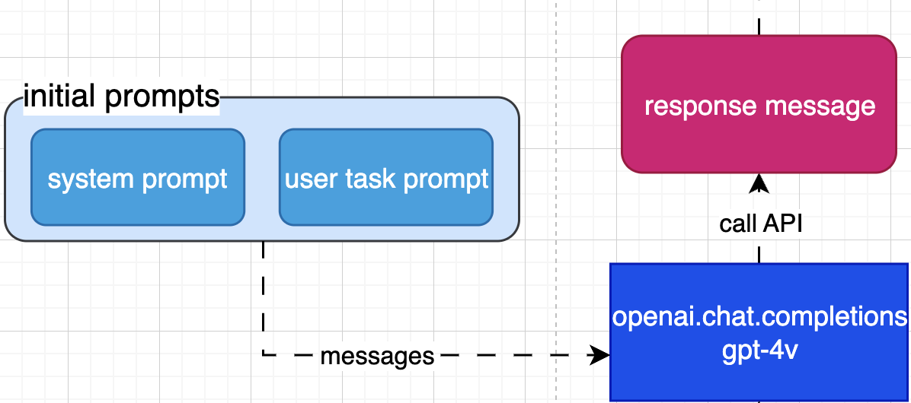

# Web AI Agent

## Introduction

In this article, we'll explore and build an AI agent that utilizes the power of new `gpt-4-vision-preview` model from OpenAI. The model can **analyze images** and provide textual responses.

This agent will be able to interact with the user, control a web browser, and process data. We'll explore its structure and how it works.

This article is inspired by a youtube video [GPT4V + Puppeteer = AI agent browse web like human? 🤖](https://www.youtube.com/watch?v=IXRkmqEYGZA&t=184s) from [AI Jason](https://www.youtube.com/@AIJasonZ).

### All the code shown in this article can be found in the repo [Ai Web Agent](https://github.com/bianbianzhu/ai-web-agent/tree/main/agent).

## Potential Use Cases

- Pair with Text to speech, it can allow people with visual impairments to browse the web.
- Quickly locate a product on an E-commerce website.

## Overview

Imagine you're keen on attending an AI event in your city this month, but you have specific criteria in mind, perhaps related to timing or the focus of the event. Normally, this would involve the following process:

- Launching a web search with terms like "AI events in [your city] this month."
- Sifting through search results to find a link that seems promising.
- Navigating the chosen website to determine its relevance, possibly needing to delve deeper through additional links.
- After much back and forth, finally pinpointing the event that fits your criteria and noting its details for your calendar.

If we break down the above process, it basically involves steps that can be categorized into the following:

1. Control the browser, such as go to a URL, click on a link, go back, etc.
1. Browser through the content of a page
1. Make decisions based on the content of that page, such as determining which link is relevant to your query.

Enter the AI agent, it does exactly what you do as we described above.

1. Browser Control: the AI uses tools like `Puppeteer` to navigate the internet. Think of Puppeteer as the AI's hands, allowing it to open tabs, click on links, and navigate web pages with ease.

1. Content Browsing: Think of this as the AI's eyes. `Puppeteer` can take screenshots of web pages, and feed them to the AI.

1. Decision-Making: This is where the AI's brain, powered by Large Language Models (LLM), comes into play. It assesses the screenshot of each page, analyzing the image, determining relevance and deciding on the next steps, mimicking human judgment.


## Architecture

As we are now clear on how the AI agent works, let's take a look at the architecture of the agent. The agent is structured as follows:


This architecture may look complex at first, but it's actually quite simple once you understand the different components and how they work together. Let's break it down.

### Starting Out

This is the starting point of the workflow. The user interacts with the agent by providing a prompt which clarifies the task (`user task prompt`). At the same time, the agent gets some default instructions (`system prompt`), about how it should do its job. These instructions tell the agent what its role is, how to format its answers, and other important info.

Here's a simple view of the starting point:



The example of the `user task prompt` might be:

```
I'm looking for AI events in Melbourne this month. Please prioritize events that are on weekends.
```

And here's what the system prompt might look like:

<image src="system-prompt.png" width=800>

Credit: [JayZeeDesign](https://github.com/JayZeeDesign/Scrape-anything---Web-AI-agent)

The system prompt is crucial because they help the agent decide how to act. The three main areas are highlighted in different colors:

- <p><span style="color:Aqua; font-weight: bold">The Agent's Role: </span> What the agent is supposed to do.</p>
- <p><span style="color:red; font-weight: bold">Response Format: </span>How the agent should present its answers.</p>
- <p><span style="color:yellow; font-weight: bold">Additional info: </span>Extra instructions to help the agent.</p>

The prompts are then sent to the openai service, which is responsible for generating responses.

Based on these prompts, the agent's response will be shaped into only 3 types:

1. `{ "url": "https://www.example.com" }` - The agent wants to navigate to a specific webpage.
2. `{ "click": "text on a button" }` - The agent wants to click on a specific element on the page.
3. `regular message` - The agent has finished the task and extracted the required information to the user.

For the initial conversation, the response would normally be a Google search url, such as `https://www.google.com/search?q=AI+events+in+Melbourne+March`. This response would then trigger the browser-controller service to navigate to the URL.

### Code implementation of the starting point

```typescript
const messages: ChatCompletionMessageParam[] = [];

// STEP 1: Welcome the user
console.log(staticMessageMap.welcome);

// STEP 2: provide the context of the conversation - system prompt
messages.push(promptMap.context());

// STEP 3: Ask and apply the user's query as a task - user task prompt
const userPrompt = await userPromptInterfaceV2(staticMessageMap.you);
messages.push(promptMap.task(userPrompt));
```

The following function creates the interface in the terminal for the user to input their query.

```typescript
/**
 * This service creates a user prompt interface and returns a promise that resolves to the user's input. Allow user to input in the `terminal`.
 * @param query
 * @returns A promise that resolves to the user's input
 */
export const userPromptInterfaceV2 = async (query: string) => {
  // Create an interface to read input from the user
  const userInterface = readline.createInterface({
    input: process.stdin,
    output: process.stdout,
  });

  // Return a promise that resolves to the user's input
  // The userInterface.question method takes a query and a callback function
  // The reason for using a promise is to make the user's input accessible outside of the callback function
  return new Promise<string>((resolve) => {
    userInterface.question(query, (input) => {
      resolve(input);
      userInterface.close(); // Close the user interface
    });
  });
};
```

And you may notice the `promptMap` object in the code. It is a map of functions that returns all the prompts. Making it a function allows the prompts to be dynamic and change based on the context of the conversation. Here is an example:

```typescript
export const promptMap = {
  context: (
    role: "teacher" | "student" | "AI"
  ): ChatCompletionMessageParam => ({
    role: "system",
    content: `You are a ${role}. You will be given instructions on what to do by browsing. You are connected to a web browser and you will be given the screenshot of the website you are on.`,
  }),
};
```

An important note is that to allow the LLM to have the `memory` of the conversation, we need to always push the new prompts to the message array and send the whole array to the LLM. This could cause the explosion of the tokens. Use the `max_tokens` parameter to build the safe net.

Below is how to use the openai service to generate the response.

```typescript
const taskFlow = async (): Promise<void> => {
  console.log(`${staticMessageMap.agent}Let me think...`);
  // Start the conversation with the LLM
  const response = await openai.chat.completions.create({
    model: "gpt-4-vision-preview",
    max_tokens: 1024,
    messages, // The messages array which contains the conversation history is sent to the LLM
    temperature: 0,
  });

  // For the initial conversation, the agent will respond with the url (google search if not provided by the user)
  const { message } = response.choices[0];
  const { content: messageText } = message;
  if (messageText === null) {
    throw new Error("The response message text is null");
  }
  // Show the response in the terminal
  console.log(`${staticMessageMap.agent}${messageText}`);

  // Memorize the answer from agent
  messages.push({
    role: "assistant",
    content: messageText,
  });
};

await taskFlow();
```

And of course, to use `openai` service, you need to have the `openai` package installed and the API key. Here is a seperate file to handle the openai service.

```typescript
import dotenv from "dotenv";
dotenv.config();
import OpenAI from "openai";

/**
 * An instance of the OpenAI Class that can invoke the API methods
 * @example `openai.chat.completions.create`
 */
export const openai = new OpenAI({
  apiKey: process.env.OPENAI_API_KEY,
});
```

### Pick the Right Path

As we mentioned earlier, the LLM response will be shaped into only 3 types. Each of these types will trigger a different browser-controller service to act accordingly.


### URL Response Flow - Response format `{ "url": "https://www.example.com" }`

- Indicate that the agent should navigate to a specific webpage.
- This response would trigger the following steps in the script:

  1. Extract the URL from the response
  1. Opens a headless browser using Puppeteer and navigates to the URL
  1. The agent then takes a screenshot of the page and sends it with another special instruction prompt back to the LLM to analyze the content of the page and decide on the next steps.


### Click Response Flow - Response format `{ "click": "text on a button" }`

- Indicate that the agent should click on a specific element on the page.
- The agent will undergo the following steps:

  1. Extract the link text from the response
  1. The agent then uses Puppeteer to find the element with the matching text and clicks on it
  1. The agent then takes a screenshot of the page and sends it with another special instruction prompt back to the LLM to analyze the content of the page and decide on the next steps.


Let's take a look at the `special instruction prompt` that the agent sends to the LLM after taking a screenshot of the page.


Credit: [JayZeeDesign](https://github.com/JayZeeDesign/Scrape-anything---Web-AI-agent)

This prompt basically tells the LLM to analyze the screenshot of the page and decide on the next steps. The response format should be exactly as we mentioned in the system prompt. With LLMs, it's often necessary to reiterate rules or guidelines to ensure consistent performance.

### Regular Message Flow - Regular message

- Indicate that the agent has finished the task and extracted the required information to the user.
- This is normally the end of the current task.
- The agent will simply display the information to the user.

### Code implementation of the path selection

```typescript
// Use typescript to define the 3 types of response
export type ResponseMessage =
  | {
      type: ResponseMessageCategory.URL;
      url: string;
    }
  | {
      type: ResponseMessageCategory.CLICK;
      linkText: string;
    }
  // This initial type is simply a placeholder to indicate the start of the conversation in which the LLM has not yet provided a response (not relevant to the path selection logic)
  | {
      type: ResponseMessageCategory.INITIAL;
      text: "initial";
    }
  | {
      type: ResponseMessageCategory.REGULAR;
      text: string;
    };
```

A function that converts the plain string response from the LLM to the defined type.

```typescript
export const convertTextToResponseMessage = (text: string): ResponseMessage => {
  // The `extractActionFromString` function is a helper function that simply checks if a string contains a particular pattern, such as '{"url": "' or '{"click": "' which is directly related to the response format. See the repo for the full implementation.
  if (extractActionFromString(text, ResponseMessageCategory.URL) !== null) {
    return {
      type: ResponseMessageCategory.URL,
      // Extract the URL from the response and store it in the `url` property, so it can be accessed easily
      url: extractActionFromString(text, ResponseMessageCategory.URL) as string,
    };
  }

  if (extractActionFromString(text, ResponseMessageCategory.CLICK) !== null) {
    return {
      type: ResponseMessageCategory.CLICK,
      // Extract the link text from the response and store it in the `linkText` property, so it can be accessed easily
      linkText: extractActionFromString(
        text,
        ResponseMessageCategory.CLICK
      ) as string,
    };
  }

  if (text === ResponseMessageCategory.INITIAL) {
    return {
      type: ResponseMessageCategory.INITIAL,
      text,
    };
  }

  return {
    type: ResponseMessageCategory.REGULAR,
    text,
  };
};
```

To implement the `Path Selection`, the code should have the following backbone:

```typescript
// messageText is the plain string response from the LLM (see above code)
// It is then converted to the defined type using the `convertTextToResponseMessage` function
responseMessage = convertTextToResponseMessage(messageText);

// if-else statement to determine the path based on the response type
// URL Response Flow
if (responseMessage.type === ResponseMessageCategory.URL) {
  // 1. Extract the URL from the response
  const { url } = responseMessage;
  // 2. Opens a headless browser using Puppeteer and navigates to the URL and take a screenshot of the page
  const imagePath = await screenshot(url, page);

  if (imagePath === undefined) {
    throw new Error("The screenshot path is undefined");
  }

  // converts the screenshot to a format that LLM accepts
  const base64String = await imageToBase64String(imagePath);
  // 3. Send the screenshot with the instruction prompt back to the LLM
  messages.push(
    promptMap.instruction({
      url: base64String,
      detail: "auto",
    })
  );
  return; // end of this path
}

// Click Response Flow
if (responseMessage.type === ResponseMessageCategory.CLICK) {
  // 1. Extract the link text from the response
  const { linkText } = responseMessage;

  // 2. The agent then uses Puppeteer to find the element with the matching text and clicks on it
  const imagePath = await clickNavigationAndScreenshot(linkText, page, browser);
  if (imagePath === undefined) {
    throw new Error("The screenshot path is undefined");
  }

  const base64String = await imageToBase64String(imagePath);
  // 3. Send the screenshot with the instruction prompt back to the LLM
  messages.push(
    promptMap.instruction({
      url: base64String,
      detail: "auto",
    })
  );
  return;
}

// Regular Message Flow - return message directly
```

### IT IS A LOOP!

Now, we are clear on the different paths the agent can take. One thing to note is that the agent will keep looping through these steps until the task is completed and respond with a regular message.

An example of the loop is like:


The URL or Click Response Flow will be fired multiple times until the agent has found the answer.

To implement the loop, the code should have the following structure:

first, a helper function to determine when to stop the loop.

```typescript
export const shouldContinueLoop = (ResponseMessage: ResponseMessage) => {
  const { type } = ResponseMessage;

  // If the response is a regular message, the agent has finished the task and the loop should stop
  if (type === ResponseMessageCategory.REGULAR) {
    return false;
  }
  // Otherwise, the loop should continue
  return true;
};
```

Then, the main loop function.

```typescript
// The initial response message before the loop starts. Basically, a placeholder.
let responseMessage: ResponseMessage = {
  type: ResponseMessageCategory.INITIAL,
  text: "initial",
};
//==================================LOOP==================================
// shouldContinueLoop determines when to stop the loop
while (shouldContinueLoop(responseMessage)) {
  // +++++ openai service to generate the response +++++
  console.log(`${staticMessageMap.agent}Let me think...`);
  const response = await openai.chat.completions.create({
    model: "gpt-4-vision-preview",
    max_tokens: 1024,
    messages,
    temperature: 0,
  });

  const { message } = response.choices[0];
  const { content: messageText } = message;
  if (messageText === null) {
    throw new Error("The response message text is null");
  }
  console.log(`${staticMessageMap.agent}${messageText}`);
  // +++++++++++++++++++++++++++++++++++++++++++++++++++

  // Memorize the answer from agent
  messages.push({
    role: "assistant",
    content: messageText,
  });

  // +++++ Path Selection +++++
  responseMessage = convertTextToResponseMessage(messageText);

  // URL Response Flow
  if (responseMessage.type === ResponseMessageCategory.URL) {
    const { url } = responseMessage;
    const imagePath = await screenshot(url, page);

    if (imagePath === undefined) {
      throw new Error("The screenshot path is undefined");
    }

    const base64String = await imageToBase64String(imagePath);
    messages.push(
      promptMap.instruction({
        url: base64String,
        detail: "auto",
      })
    );
    // Instead of stopping here, we need to continue the loop for the next step
    continue;
  }

  // Click Response Flow
  if (responseMessage.type === ResponseMessageCategory.CLICK) {
    const { linkText } = responseMessage;

    try {
      const imagePath = await clickNavigationAndScreenshot(
        linkText,
        page,
        browser
      );
      if (imagePath === undefined) {
        throw new Error("The screenshot path is undefined");
      }

      const base64String = await imageToBase64String(imagePath);
      messages.push(
        promptMap.instruction({
          url: base64String,
          detail: "auto",
        })
      );

      // continue the loop for the next step
      continue;
    } catch (err) {
      // Handle the error and retry if the link is not found; sometimes the LLM just comes up with a link that doesn't exist or with a typo
      if (
        err instanceof Error &&
        err.message.includes("Link with text not found")
      ) {
        console.log(`...Error clicking on link: ${err.message}`);
        messages.push(promptMap.retryIfLinkNotFound(linkText));
        continue;
      } else {
        console.log(`...Unexpected error: ${err}. Please try again.`);
        break;
      }
    }
  }
  // ++++++++++++++++++++++++++++
}
```

As you may notice, we didn't specify the regular message flow in the loop. This is because the regular message does not trigger any browser-controller service. It simply ends the loop and displays the message to the user, simply a `console.log` statement. Of course, you can add more logic to the regular message flow such as saving the message to a csv file, etc.

```typescript
console.log(`${staticMessageMap.agent}${messageText}`);
```

## Directory Structure

After understanding the main flow of the agent, let's take a look at the directory structure of the agent.

```
agent.ts
services/
├── browser-controller.ts
├── data-transformer.ts
├── element-annotator.ts
├── openai.ts
├── prompt-map.ts
└── user-prompt-interface.ts
utils.ts
```

`agent.ts`: This is the main script for our agent. It orchestrates the other services and is responsible for the main execution flow of the agent. It contains the starting point, the main loop, and the path selection logic.

`services/`: This directory contains various services used by the agent. Each service is responsible for a specific task.

- browser-controller.ts: This service controls the browser using Puppeteer. It can navigate to pages, interact with elements, and take screenshots.
- data-transformer.ts: This service transforms data for the agent. It can format data, clean it, and prepare it for further processing.
- element-annotator.ts: This service annotates HTML elements for the agent. It can highlight elements, add unique identifiers to them, and more.
- openai.ts: This service interfaces with the OpenAI API.
- prompt-map.ts: This service maps user prompts to actions. It can determine what action the agent should take based on the user's input.
- user-prompt-interface.ts: This service interfaces with the user to get prompts. It can read user input and pass it to the agent.

`utils.ts`: This file contains utility functions used by the agent. These functions are used throughout the agent code to perform common tasks.

For the full code implementation, please refer to the [Ai Web Agent](https://github.com/bianbianzhu/ai-web-agent).

## Browser Controller Service

Now, let's dive into how the agent controls the browser - how its hands work.
A library called `Puppeteer` is used here. It provides a high-level API over the Chrome DevTools Protocol. See the [Puppeteer documentation](https://pptr.dev/) for more details.

Essentially, Puppeteer gets called after the agent receives a response from the LLM. Under different paths as we mentioned above, Puppeteer will execute different actions.

Overall, the browser-controller service is responsible for the following:

1. Navigating to a URL
1. Clicking on a link
1. Taking a screenshot of the page


There is, in fact, another step taken before the agent takes a screenshot of the page - `Highlighting interactive elements`. We have separated this service into a different file to make the code more modular and easier to maintain. It will be discussed in the next section.

### Code implementation of the browser-controller service

#### Step 1 - Initialize the browser and open a new tab

```typescript
const browserWindowSize = { width: 900, height: 1600 };

/**
 * This service initializes a new browser session and a new page tab
 * @returns An object containing the browser and the page
 */
export const initController = async () => {
  const pup = puppeteer.default.use(StealthPlugin());
  // launch the browser
  const browser = await pup.launch({
    // detailed configurations
    headless: false, // Determines whether to run the browser in headless mode (without a GUI). boolean | "new" | undefined
    executablePath: process.env.GOOGLE_CHROME_CANARY_PATH, // path to a browser executable to use instead of the bundled Chromium
    userDataDir: process.env.GOOGLE_CHROME_CANARY_USER_DATA_DIR, // Path to a user data directory, i.e, the user profile
    args: [
      `--profile-directory=${process.env.PROFILE}`, // Select the expected profile
      "--disable-setuid-sandbox",
      "--no-sandbox",
      "--no-zygote",
      `--window-size=${browserWindowSize.width},${browserWindowSize.height}`,
    ],
  });

  // open a new tab
  const page = await browser.newPage();

  // set the viewport
  await page.setViewport({
    width: browserWindowSize.width,
    height: browserWindowSize.height,
    deviceScaleFactor: 1,
  });

  // the initialized browser and page are returned
  return { browser, page };
};
```

Based on different response flows, the agent would either navigate to a URL and take a screenshot, or click on a link which triggers a navigation and take a screenshot.

#### 2.1 `URL Response Flow`: Navigate to a URL and take a screenshot

```typescript
export const navToUrlAndScreenshot = async (url: string, page: Page) => {
  console.log(`...Opening ${url}`);
  // validate the URL
  if (!isValidURL(url)) {
    throw new Error(`Invalid URL: ${url}`);
  }

  // +++++ go to the URL +++++
  await page.goto(url, {
    // a simple logic to determine if the page is loaded: wait 500 ms after the number of active network requests are 2
    waitUntil: "networkidle2",
    timeout: TIMEOUT,
  });
  // +++++++++++++++++++++++++++

  // +++++ take a screenshot of the page +++++
  // also include waiting for the page to load completely
  const imagePath = await waitAndScreenshot(page);
  // +++++++++++++++++++++++++++++++++++++++++

  return imagePath;
};
```

#### The `waitAndScreenshot` function

```typescript
const waitAndScreenshot = async (page: Page) => {
  // is the page still loading? `document.readyState` === 'loading' or there is a loading indicator on the page
  const isLoading = await isPageExplicitlyLoading(page);

  // if the page is still loading, wait for the page to load completely
  isLoading && (await waitTillHTMLRendered(page));

  // apply Set-of-Mark Prompting
  console.log(`...Highlight all interactive elements`);
  await highlightInteractiveElements(page);

  // take a screenshot of the page
  console.log(`...Taking screenshot`);
  await page.screenshot({
    //path: "/agent/web-agent-screenshot.jpg" is a wrong path
    path: imagePath,
    fullPage: true,
  });

  return imagePath;
};
```

The screenshot is simply taken by calling `page.screenshot()`. You may change the configuration to meet your needs.

#### The `waitTillHTMLRendered` function

As shown, the navigation to the URL is done via `page.goto()`. This method utilizes the `waitUntil` option for the page load. After the page is loaded, the agent takes a screenshot. It is very crucial to wait for all the visual content to be loaded before taking the screenshot to ensure the agent gets the full info of the page.

Unfortunately, in many cases, the `waitUntil` in `GoToOptions` (page.goto()) is not enough to wait for the page to load completely (especially with dynamic loading content), so we need to use the custom function `waitTillHTMLRendered`.

This function basically checks if the page is still loading via `document.readyState` or if there is a loading indicator on the page.
If the page is still loading, the function will call `waitTillHTMLRendered` to undertake a comprehensive check:

1. It checks the HTML size every second.
1. If the HTML size remains the same for 3 consecutive seconds, it assumes the page has finished loading.
1. Throw error if the page is still loading after 30 seconds (timeout).

The flowchart below shows the logic of the `waitTillHTMLRendered` function:


To have a better understanding of the `waitAndScreenshot` function, let's take a look at the log of the function in action:


After the page is **completely** loaded, all interactive elements are highlighted and a screenshot is taken.

```typescript
export const waitTillHTMLRendered = async (
  page: Page,
  timeout: number = 30000,
  checkOnlyHTMLBody: boolean = false
) => {
  const waitTimeBetweenChecks: number = 1000;
  const maximumChecks: number = timeout / waitTimeBetweenChecks; // assuming check itself does not take time
  let lastHTMLSize = 0;
  let stableSizeCount = 0;
  const COUNT_THRESHOLD = 3;

  const isSizeStable = (currentSize: number, lastSize: number) => {
    if (currentSize !== lastSize) {
      return false; // still rendering
    } else if (currentSize === lastSize && lastSize === 0) {
      return false; // page remains empty - failed to render
    } else {
      return true; // stable
    }
  };

  for (let i = 0; i < maximumChecks; i++) {
    const html = await page.content();
    const currentHTMLSize = html.length;

    const currentBodyHTMLSize = await page.evaluate(
      () => document.body.innerHTML.length
    );

    const currentSize = checkOnlyHTMLBody
      ? currentBodyHTMLSize
      : currentHTMLSize;

    // logging
    console.log(
      "last: ",
      lastHTMLSize,
      " <> curr: ",
      currentHTMLSize,
      " body html size: ",
      currentBodyHTMLSize
    );

    stableSizeCount = isSizeStable(currentSize, lastHTMLSize)
      ? stableSizeCount + 1
      : 0;

    console.log(`Stable size count: ${stableSizeCount}`);
    // if the HTML size remains the same for 3 consecutive seconds, it assumes the page has finished loading
    if (stableSizeCount >= COUNT_THRESHOLD) {
      console.log("Page rendered fully..");
      break;
    }

    lastHTMLSize = currentSize;
    await page.waitForTimeout(waitTimeBetweenChecks);
  }
};
```

#### 2.2 `Click Response Flow`: The `clickNavigationAndScreenshot` function

This function is used to click on a specific element on the page and wait for the page to load completely and then take a screenshot. For the `click` action, it utilizes another function called `clickOnLink`.

```typescript
export const clickNavigationAndScreenshot = async (
  linkText: string,
  page: Page,
  browser: Browser
) => {
  let imagePath;
  try {
    const navigationPromise = page.waitForNavigation();
    // The Click action
    const clickResponse = await clickOnLink(linkText, page);
    if (!clickResponse) {
      // if the link triggers a navigation on the same page, wait for the page to load completely and then take a screenshot
      await navigationPromise;
      imagePath = await waitAndScreenshot(page);
    } else {
      // if the link opens in a new tab, ignore the navigationPromise as there won't be any navigation
      navigationPromise.catch(() => undefined);
      // switch to the new tab and take a screenshot
      const newPage = await newTabNavigation(clickResponse, page, browser);

      if (newPage === undefined) {
        throw new Error("The new page cannot be opened");
      }

      imagePath = await waitAndScreenshot(newPage);
    }

    return imagePath;
  } catch (err) {
    throw err;
  }
};
```

#### The `clickOnLink` function

This function loops through all the elements with the `gpt-link-text` attribute (unique identifier received during element annotation) and clicks on the one that matches the link text provided by the LLM.

```typescript
const clickOnLink = async (linkText: string, page: Page) => {
  try {
    const clickResponse = await page.evaluate(async (linkText) => {
      const isHTMLElement = (element: Element): element is HTMLElement => {
        return element instanceof HTMLElement;
      };
      const elements = document.querySelectorAll("[gpt-link-text]");

      for (const element of elements) {
        if (!isHTMLElement(element)) {
          continue;
        }

        if (
          element
            .getAttribute("gpt-link-text")
            ?.includes(linkText.trim().toLowerCase())
        ) {
          // This if statement is to handle the case where the link opens in a new tab
          if (element.getAttribute("target") === "_blank") {
            return element.getAttribute("gpt-link-text");
          }

          element.style.backgroundColor = "rgba(255,255,0,0.25)";
          element.click();
          return;
        }
      }

      // only if the loop ends without returning
      throw new Error(`Link with text not found: "${linkText}"`);
    }, linkText);

    return clickResponse;
  } catch (err) {
    if (err instanceof Error) {
      throw err;
    }
  }
};
```

## Element Annotation Service

Let's look deeper into the `highlightInteractiveElements` function that is called inside `waitAndScreenshot`.

It is a service that annotates the interactive HTML elements for the agent. It can highlight elements with a `red bounding box` and add unique identifiers to them.

Imagine giving your AI agent a special pair of glasses that lets it see the interactive spots on a website—the buttons, links, and fields—like glowing treasures on a treasure map.

That's essentially what the `highlightInteractiveElements` function does. It's like a highlighter for the digital world, sketching red boxes around clickable items and tagging them with digital nametags.

**With the annotation, the accuracy of the agent's interpretation of the image is largely improved**. This concept is called `Set-of-Mark Prompting`.

Here is an example of the annotated screenshot:


There is a research paper discussing the importance of this topic in detail: [Set-of-Mark Prompting](https://arxiv.org/abs/2310.11441).

Here's how it performs:

1. It starts by removing any old digital nametags (html attribute `gpt-link-text`) that might confuse our AI.
2. Then, it lights up every clickable thing it finds with a red outline to help the AI spot where to 'click'.
3. Each interactive element gets a unique nametag. This tag/attribute will be used to identify the element that Puppeteer can later interact with.

One key detail to remember is when dealing with puppeteer or any other testing framework that programmatically interacts with the web, the element with a link text may not be visible. Here is a simple example:

```html
<div style="display: none">
  <a href="https://www.example.com">
    <span>Click me</span>
  </a>
</div>
```

The parent div is hidden, so the link is not visible. This element should be excluded. Recursive checking the parent element is necessary to ensure the element is visible. See below graph for the logic:


### Code implementation of the `highlightInteractiveElements` function

```typescript
import { Page } from "puppeteer";

const INTERACTIVE_ELEMENTS = [
  "a",
  "button",
  "input",
  "textarea",
  "[role=button]",
  "[role=treeitem]",
  '[onclick]:not([onclick=""])',
];

/**
 * Reset the unique identifier attribute and remove previously highlighted elements
 * @param page
 */
const resetUniqueIdentifierAttribute = async (page: Page): Promise<void> => {
  await page.evaluate(() => {
    const UNIQUE_IDENTIFIER_ATTRIBUTE = "gpt-link-text";
    const elements = document.querySelectorAll(
      `[${UNIQUE_IDENTIFIER_ATTRIBUTE}]`
    );
    for (const element of elements) {
      element.removeAttribute(UNIQUE_IDENTIFIER_ATTRIBUTE);
    }
  });
};

/**
 * This function annotates all the interactive elements on the page
 * @param page
 */
const annotateAllInteractiveElements = async (page: Page) => {
  // $$eval method runs Array.from(document.querySelectorAll(selector)) within the `page`and passes the result as the first argument to the pageFunction.
  // If no elements match the selector, the first argument to the pageFunction is [].
  await page.$$eval(
    INTERACTIVE_ELEMENTS.join(", "), // the selector can be defined outside the browser context

    // the argument `elements` can be an empty array if no elements match the selector
    function (elements) {
      // any console.log will not be visible in the node terminal
      // instead, it will be visible in the browser console

      // handle empty array
      if (elements.length === 0) {
        throw new Error("No elements found");
      }

      //======================================VALIDATE ELEMENT CAN INTERACT=================================================
      // This run-time check must be defined inside the pageFunction as it is running in the browser context. If defined outside, it will throw an error: "ReferenceError: isHTMLElement is not defined"
      const isHTMLElement = (element: Element): element is HTMLElement => {
        // this assertion is to allow Element to be treated as HTMLElement and has `style` property
        return element instanceof HTMLElement;
      };

      const isElementStyleVisible = (element: Element) => {
        const style = window.getComputedStyle(element);
        return (
          style.display !== "none" &&
          style.visibility !== "hidden" &&
          style.opacity !== "0" &&
          style.width !== "0px" &&
          style.height !== "0px"
        );
      };

      const isElementVisible = (element: Element | undefined | null) => {
        if (element === null || element === undefined) {
          throw new Error("isElementVisible: Element is null or undefined");
        }

        let currentElement: Element | null = element;
        while (currentElement) {
          if (!isElementStyleVisible(currentElement)) {
            return false;
          }

          currentElement = currentElement.parentElement;
        }
        return true;
      };

      //========================================PREPARE UNIQUE IDENTIFIER================================================

      const setUniqueIdentifierBasedOnTextContent = (element: Element) => {
        const UNIQUE_IDENTIFIER_ATTRIBUTE = "gpt-link-text";
        const { textContent, tagName } = element;
        // if the node is a document or doctype, textContent will be null
        if (textContent === null) {
          return;
        }

        element.setAttribute(
          UNIQUE_IDENTIFIER_ATTRIBUTE,
          textContent.trim().toLowerCase()
        );
      };

      //========================================HIGHLIGHT INTERACTIVE ELEMENTS================================================
      for (const element of elements) {
        if (isHTMLElement(element)) {
          // highlight all the interactive elements with a red bonding box
          element.style.outline = "2px solid red";
        }

        // assign a unique identifier to the element
        if (isElementVisible(element)) {
          // set a unique identifier attribute to the element
          // this attribute will be used to identify the element that puppeteer should interact with
          setUniqueIdentifierBasedOnTextContent(element);
        }
      }
    }
  );
};

/**
 * This function highlights all the interactive elements on the page
 * @param page
 */
export const highlightInteractiveElements = async (page: Page) => {
  await resetUniqueIdentifierAttribute(page);
  await annotateAllInteractiveElements(page);
};
```

## Conclusion

In this article, we have gone through the architecture of the AI agent, the code implementation of each step, and some concepts behind the design, such as Set-of-Mark Prompting. The agent is an elegant system that requires careful orchestration of different services to work effectively, and currently it has plenty of issues and limitations. If you have any questions or suggestions, please feel free to reach out to me. I would be happy to discuss this topic further.
